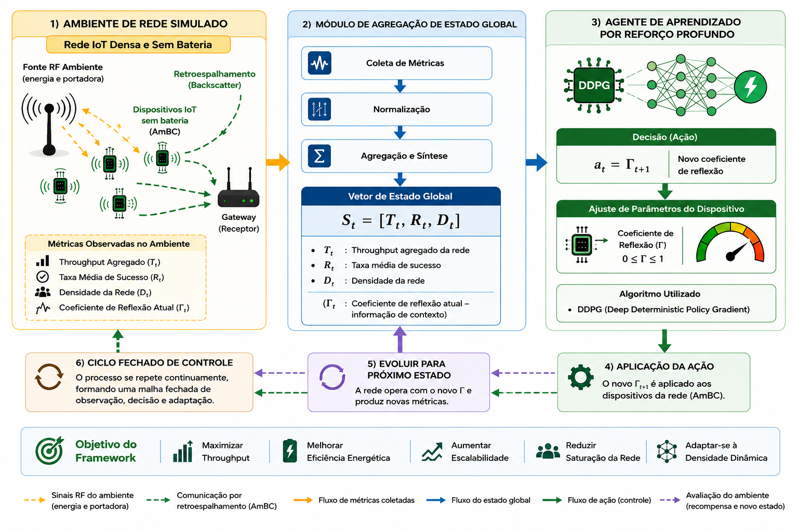

# GlobalAmBC-DRL

> A Deep Reinforcement Learning framework for adaptive control in dense batteryless Internet of Things (IoT) networks using Ambient Backscatter Communication (AmBC).

---
[]()
[]()
[]()
[]()
[](https://doi.org/10.5281/zenodo.21463717)

## Overview

GlobalAmBC-DRL is an open-source research framework designed to investigate adaptive control strategies for dense batteryless IoT networks using Ambient Backscatter Communication (AmBC).

The framework integrates OMNeT++ network simulations with a Deep Reinforcement Learning (DRL) agent capable of dynamically adjusting the reflection coefficient of batteryless devices according to global network conditions.

The objective is to improve:

- Throughput
- Energy Efficiency
- Network Stability
- Scalability in Dense IoT Scenarios

This repository accompanies the research developed during the PhD project at the Federal University of Goiás (UFG), Brazil.

The framework implements the GlobalAmBC-DRL Control Module, a centralized decision-making architecture that continuously adapts the reflection coefficient of batteryless IoT devices based on aggregated network state information.

---

## System Architecture

The GlobalAmBC-DRL framework integrates network simulation, global state aggregation, and Deep Reinforcement Learning (DDPG) to enable adaptive control in dense batteryless IoT networks based on Ambient Backscatter Communication (AmBC).

<p align="center">
  
</p>

<p align="center">
<b>Figure 1.</b> Overall architecture of the GlobalAmBC-DRL framework.
</p>

The framework operates as a closed-loop control system composed of four main components:

- **OMNeT++ Simulation Environment:** simulates dense batteryless IoT networks.
- **Global State Aggregator:** collects network-wide metrics.
- **DDPG Agent:** computes the optimal reflection coefficient.
- **Adaptive Reflection Controller:** applies the selected action to the simulated network.

---
---

# Repository Structure

The repository is organized as follows:

```text
GlobalAmBC-DRL/
│
├── docs/
│   ├── FiguraPrincipal4.png
│   ├── Guia_tecnico_auxiliar_Portugues...
│   └── technical_guide_beginner_INGL...
│
├── omnetpp/
│   ├── simulations
│   ├── src
│   └── configuration files
│
├── scripts/
│   ├── data processing
│   ├── automation
│   └── analysis
│
├── LICENSE
├── README.md
└── .gitignore
```

### Main directories

| Directory | Description |
|-----------|-------------|
| **docs/** | Documentation, architecture figures, and technical guides. |
| **omnetpp/** | OMNeT++ simulation environment and network models. |
| **scripts/** | Python scripts for automation, processing, and experiment execution. |
| **README.md** | Project documentation. |
| **LICENSE** | MIT License. |


---

# Requirements

To reproduce the experiments presented in this repository, the following software is required:

| Software | Version |
|----------|---------|
| OMNeT++ | 6.x |
| INET Framework | Compatible version |
| Python | 3.10 or newer |
| Git | Latest |
| Operating System | Windows or Linux |

Recommended hardware:

- 8 GB RAM (minimum)
- 16 GB RAM (recommended)
- Multi-core processor

---

# Installation

Clone the repository:

```bash
git clone https://github.com/edwardes-galhardo/GlobalAmBC-DRL.git
```

Enter the project directory:

```bash
cd GlobalAmBC-DRL
```

Open the OMNeT++ workspace and import the project.

Compile the project using the OMNeT++ IDE.


---

# Running the Experiments

The experiments can be executed directly from the OMNeT++ IDE.

Typical execution flow:

1. Open the project.
2. Build the project.
3. Select the desired simulation configuration (.ini).
4. Execute the simulation.
5. Export the generated results.
6. Run the Python scripts available in the `scripts/` directory to process the collected data.

---

# Publications

This software supports the experimental evaluation presented in the following scientific publications.

## SBRC 2026

**A New Centralized DRL Control Module for Dense Batteryless IoT Networks Based on Ambient Backscatter Communication**

- Conference: Brazilian Symposium on Computer Networks and Distributed Systems (SBRC 2026)
- Authors: Edwardes Amaro Galhardo, Antonio Carlos de Oliveira Jr., Carlos Becker Westphall, Wesley dos Reis Bezerra
- Repository: https://github.com/edwardes-galhardo/GlobalAmBC-DRL

---

## Journal of Network and Computer Applications (JNCA)

**DDPG-AmBC: Dynamic Reflection Control for Batteryless IoT Networks Using Ambient Backscatter Communication**

- Journal: Journal of Network and Computer Applications
- Related repository: GlobalAmBC-DRL

---

# Citation

This software is permanently archived on Zenodo.

**DOI:** https://doi.org/10.5281/zenodo.21463717


If you use this software in your research, please cite the associated publication.


@article{GALHARDO2026104509,
title = {DDPG-AmBC: Dynamic reflection control for batteryless IoT networks with ambient backscatter},
journal = {Journal of Network and Computer Applications},
volume = {251},
pages = {104509},
year = {2026},
issn = {1084-8045},
doi = {https://doi.org/10.1016/j.jnca.2026.104509},
url = {https://www.sciencedirect.com/science/article/pii/S1084804526000846},
author = {Edwardes A. Galhardo and Carlos B. Westphall and Antonio Carlos {de Oliveira}},
keywords = {Ambient Backscatter Communication, Batteryless ioT, Dense ioT networks, Deep reinforcement learning, DDPG, Reflection control, Energy efficiency, Throughput optimization},
abstract = {Batteryless Internet of Things (IoT) networks enabled by Ambient Backscatter Communication (AmBC) represent a promising approach for large-scale and energy-sustainable deployments. Yet, dense and time-varying environments introduce major challenges, such as unpredictable fluctuations in incident RF power, strong interference, and unstable link quality. These non-stationary conditions make traditional fixed or reactive reflection-level control methods suboptimal. This work introduces DDPG-AmBC, a deep reinforcement learning (DRL) framework designed to perform continuous and adaptive reflection control for batteryless AmBC devices. The method employs the Deep Deterministic Policy Gradient (DDPG) algorithm to dynamically adjust the reflection coefficient (Γ) based on real-time observations of the wireless environment. This mechanism enables joint optimization of communication throughput and energy efficiency while preserving passive operation. The paper presents a complete system formulation, an expanded discussion of related studies, and comparative evaluations against fixed-reflection and competitive DRL-based baselines. The results show that DDPG-AmBC significantly improves throughput stability under varying interference conditions and supports enhanced energy-sustainable operation. Experiments conducted using OMNeT++ for network emulation and Google Colab for DRL training confirm the effectiveness of the proposed framework and its suitability for next-generation IoT scenarios.}
}

---

# License

This project is distributed under the MIT License.

See the LICENSE file for more information.

---

# Authors

**Edwardes Amaro Galhardo**

PhD Candidate in Computer Science

Federal University of Goiás (UFG)

Advisor: Prof. Antonio Carlos de Oliveira Jr.

Co-advisor: Prof. Carlos Becker Westphall

GitHub: https://github.com/edwardes-galhardo


## Key Features

- Adaptive reflection coefficient optimization
- Deep Reinforcement Learning (DDPG)
- OMNeT++ simulation environment
- Batteryless IoT networks
- Ambient Backscatter Communication
- Modular architecture
- Reproducible scientific experiments

---

